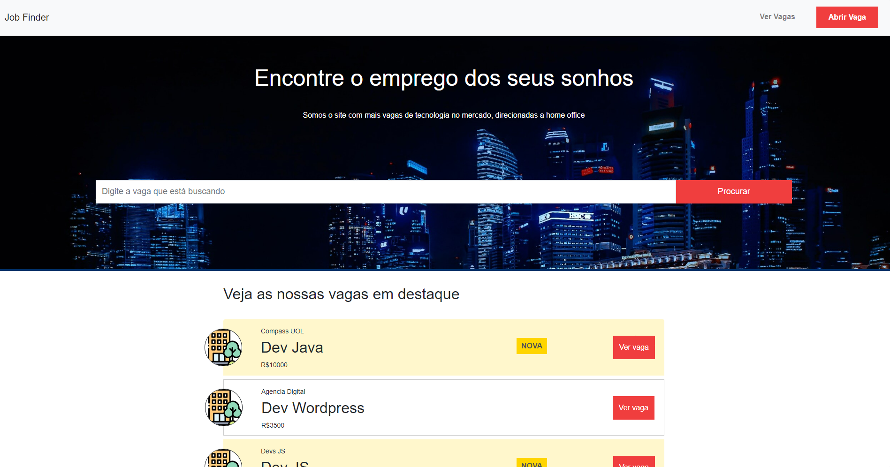
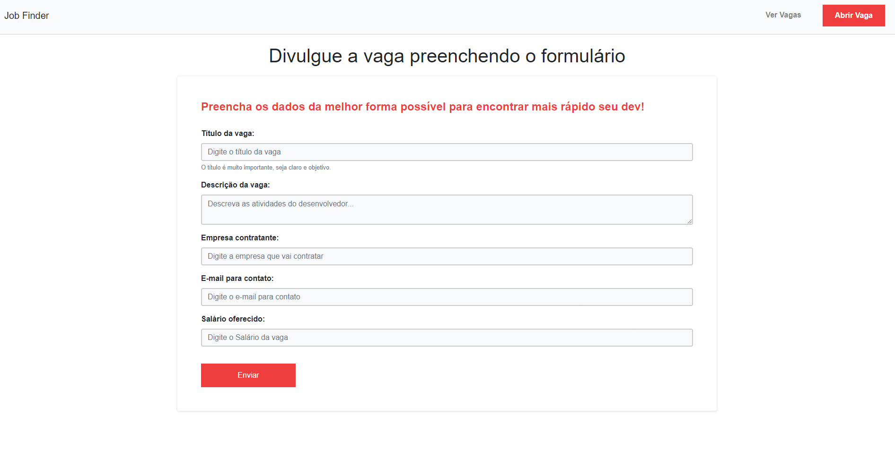
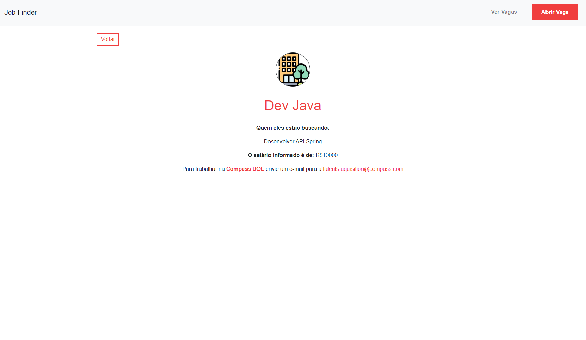

<h1 align="center" style="font-weight: bold;">Jobs Finder 💻</h1>

<p align="center">
     <a href="#tech">Technologies</a> • 
    <a href="#started">Getting Started</a> • 
    <a href="#routes">API Endpoints</a> 
</p>

<p align="center">
    <b>Interactive handlebar pages to list and add job vancancies, using a Express API to deal with data storage and manipulation.</b>
</p>
<a href="#get-home-detail"> </a>
<a href="#post-job-detail"> </a>
<a href="#get-job-detail"> </a>

<h2 id="technologies">💻 Technologies</h2>

- HTML / Handlebars
- CSS
- Bootstrap
- NodeJS
- Express

<h2 id="started">🚀 Getting started</h2>


<h3>Prerequisites</h3>

- NodeJS installed
<h3>Cloning</h3>

How to clone your project

```bash
git clone https://github.com/LuizManoeldev/jobs-finder.git
```

<h3>Starting</h3>

1. Install all dependecies.

```bash
npm install
```
2. run server.
```bash
npm run dev 
```
<h2 id="routes">📍 API Endpoints</h2>

​
| route               | description                                          
|----------------------|-----------------------------------------------------
| <kbd>GET /</kbd>     | home page. [response details](#get-home-detail)
| <kbd>POST      /jobs/add </kbd>     | form to persist a job. [request details](#post-job-detail)
| <kbd>GET /jobs/view/:id</kbd>     | job details. [response details](#get-job-detail)

<h3 id="get-home-detail">GET /</h3>

**RESPONSE - Handlebar page**
```handlebars
{
  <div id="top-container" class="container-fluid">
  <h1 id="main-title" class="text-center">Encontre o emprego dos seus sonhos</h1>
  <p id="main-subtitle" class="text-center">Somos o site com mais vagas de tecnologia no mercado, direcionadas a home office</p>
  <form id="search-form" class="form-inline" action="/" method="GET">
    <div class="form-group col-md-10">
      <input type="text" class="form-control" id="job" name="job" placeholder="Digite a vaga que está buscando">
    </div>
    <div class="col-md-2">
      <button type="submit" class="btn btn-primary">Procurar</button>
    </div>
  </form>
</div>
<main>
  <div id="jobs-container" class="container">
    <div class="row">
      <div class="col-md-12">
        {{#if search}}
          <h2 id="job-list-title">Buscando vagas que contem: {{search}}</h2>
        {{else}}
          <h2 id="job-list-title">Veja as nossas vagas em destaque</h2>
        {{/if}}
        <ul id="job-list" class="list-group">
          {{#each jobs}}
            <li class="list-group-item {{#if dataValues.new_job }}new-job{{/if}}">
              
              <p>{{dataValues.company}}</p>
              <h2>{{dataValues.title}}</h2>
              <p>R${{dataValues.salary}}</p>
              <span class="new-job-label">Nova</span>
              <a class="btn btn-primary" href="/jobs/view/{{dataValues.id}}">Ver vaga</a>
            </li>
          {{/each}}
        </ul>
      </div>
    </div>
  </div>
</main>
}
```

<h3 id="post-job-detail">POST /jobs/add</h3>

**REQUEST**
```json
{
  "title": "Dev Java",
  "description": "API development",
  "salary": "R$10000",
  "company": "Devs Club",
  "email": "talent.aquisition@devsclub.com",
  "new_job": "1",
}
```

<h3 id="get-job-detail">POST /jobs/view/:id</h3>

**RESPONSE - Handlebar page**
```handlebars
{
  <div id="job-view-container" class="container">
  <div class="row text-center">
    <a class="back-link main-color" href="/">Voltar</a>
    <div id="img-container" class="col-md-12">
      
    </div>
    <div class="col-md-12">
      <h1 class="main-color">{{job.dataValues.title}}</h1>
      <p class="bold">Quem eles estão buscando:</p>
      <p class="job-desc">{{job.dataValues.description}}</p>
      <p><span class="bold">O salário informado é de:</span> R${{job.dataValues.salary}}</p>
      <p>
        Para trabalhar na <span class="bold main-color">{{job.dataValues.company}}</span> envie um e-mail para a <a class="main-color" href="mail:to{{job.dataValues.email}}">{{job.dataValues.email}}</a>
      </p>
    </div>
  </div>
</div>
}
```


